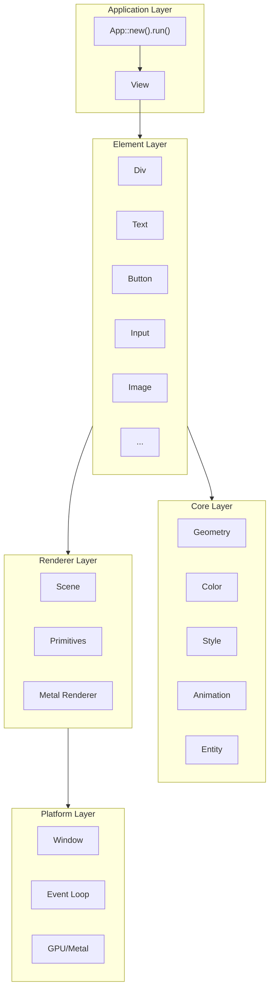
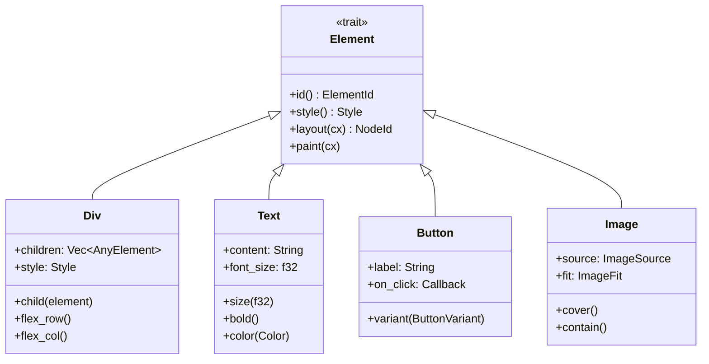
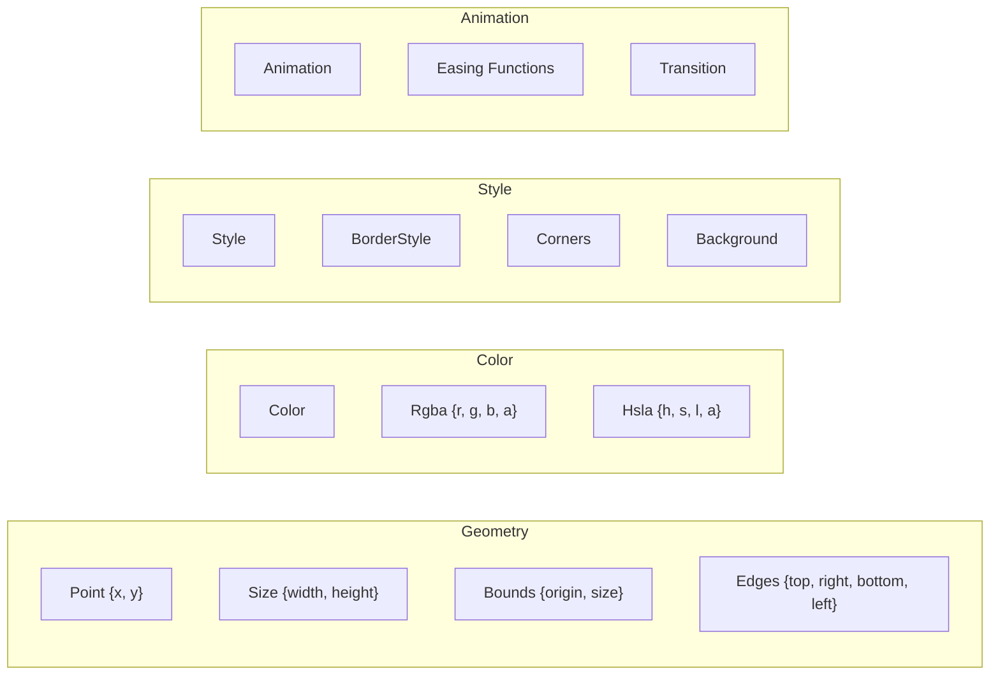
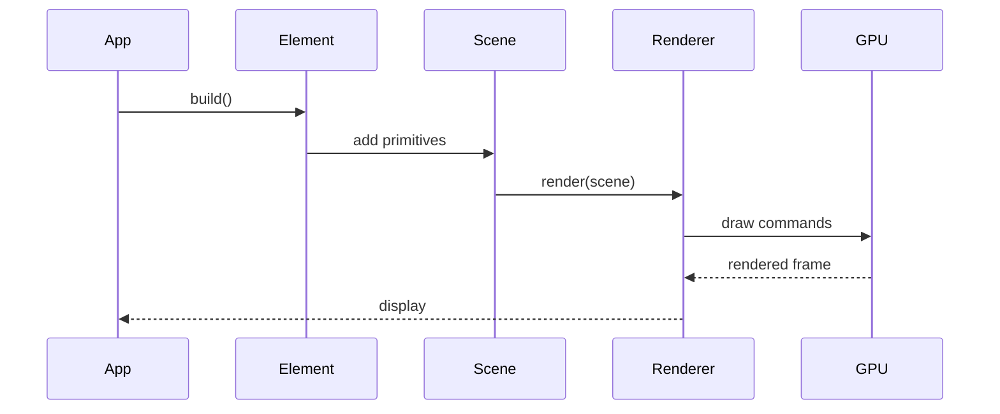
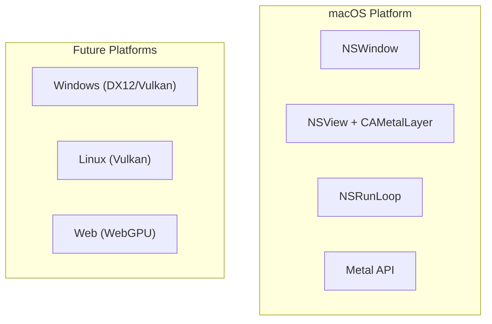
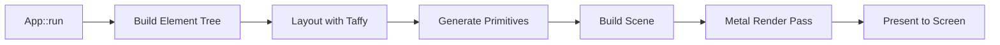
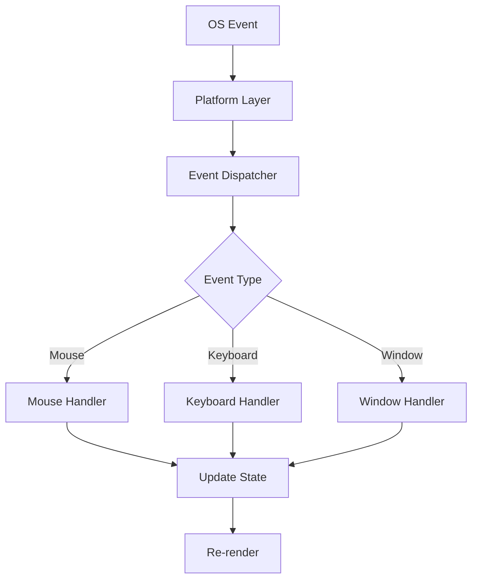
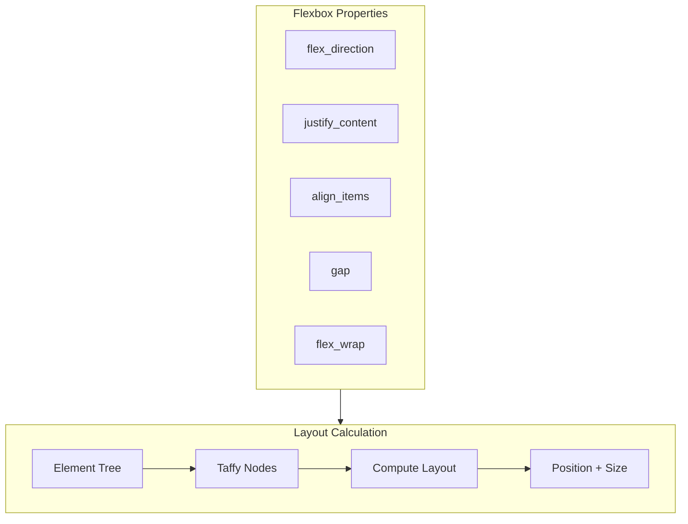
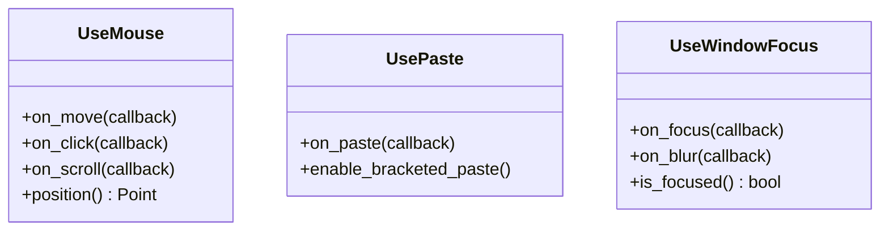
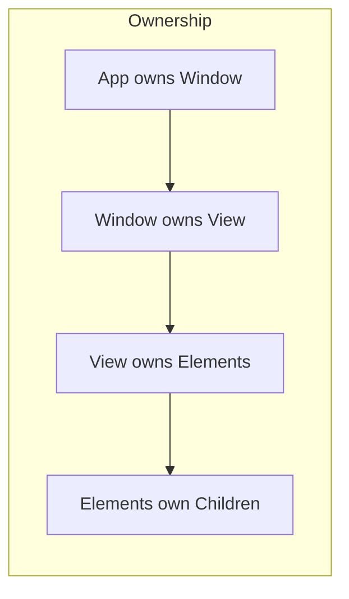

# RUI Architecture

This document describes the architecture of RUI, a GPU-accelerated UI framework for Rust.

## Overview

RUI is designed with a layered architecture that separates concerns and enables high-performance GPU rendering.



## Layer Responsibilities

### 1. Application Layer

The entry point for RUI applications.

```rust
App::new().run(|cx| {
    // Build your UI here
    div()
        .child(text("Hello"))
});
```

**Components:**
- `App` - Application lifecycle management
- `AppContext` - Global application state and services
- `View` - View abstraction for rendering
- `ViewContext` - View-local state and rendering context

### 2. Element Layer

UI building blocks with a declarative builder pattern.



### 3. Core Layer

Fundamental types and abstractions.



### 4. Renderer Layer

GPU-accelerated rendering pipeline.



**Primitives:**
- `Quad` - Rectangles with background, border, corners
- `Text` - Text rendering with font styling
- `Image` - Texture-based image rendering
- `Shadow` - Drop shadows with blur

### 5. Platform Layer

OS-specific window and event handling.



## Data Flow

### Rendering Pipeline



### Event Flow



## Layout System

RUI uses [Taffy](https://github.com/DioxusLabs/taffy) for Flexbox layout.



**Layout Properties:**
- `flex_direction` - Row or Column
- `justify_content` - Main axis alignment
- `align_items` - Cross axis alignment
- `gap` - Space between children
- `padding` - Inner spacing
- `margin` - Outer spacing

## Hooks System

React-like hooks for managing state and side effects.



## Memory Management

RUI uses Rust's ownership system for memory safety with minimal allocations.



**Strategies:**
- `SmallVec` for small collections
- `SlotMap` for entity storage
- Stack allocation for primitives
- GPU buffer pooling

## Module Structure

```
rui/
├── src/
│   ├── lib.rs              # Library entry
│   ├── prelude.rs          # Common exports
│   │
│   ├── core/               # Core types
│   │   ├── app.rs          # Application
│   │   ├── color.rs        # Color types
│   │   ├── geometry.rs     # Geometry types
│   │   ├── style.rs        # Style system
│   │   ├── animation.rs    # Animations
│   │   ├── entity.rs       # Entity system
│   │   ├── view.rs         # View abstraction
│   │   └── window.rs       # Window management
│   │
│   ├── elements/           # UI Elements
│   │   ├── element.rs      # Element trait
│   │   ├── div.rs          # Container
│   │   ├── text.rs         # Text
│   │   ├── button.rs       # Button
│   │   ├── input.rs        # Text input
│   │   ├── image.rs        # Image
│   │   ├── table.rs        # Table
│   │   ├── list.rs         # Lists
│   │   ├── progress.rs     # Progress bar
│   │   └── spinner.rs      # Spinner
│   │
│   ├── hooks/              # React-like hooks
│   │   ├── use_mouse.rs    # Mouse events
│   │   ├── use_paste.rs    # Paste events
│   │   └── use_window_focus.rs
│   │
│   ├── renderer/           # Rendering
│   │   ├── scene.rs        # Scene graph
│   │   └── primitive.rs    # Render primitives
│   │
│   └── platform/           # Platform-specific
│       └── macos/          # macOS (Metal)
│
└── examples/               # Example apps
    ├── hello_world.rs
    ├── counter.rs
    ├── dashboard.rs
    └── animation_demo.rs
```

## Performance Considerations

### GPU Rendering
- Direct Metal rendering bypasses CPU-bound drawing
- Batched draw calls reduce GPU state changes
- Vertex buffer reuse minimizes allocations

### Layout Caching
- Taffy caches layout calculations
- Only dirty subtrees are recalculated
- Incremental layout updates

### Memory Efficiency
- Zero-copy where possible
- Pre-allocated buffers
- Minimal heap allocations in hot paths

## Future Directions

1. **Cross-Platform Support**
   - Vulkan renderer for Windows/Linux
   - WebGPU for browser support

2. **State Management**
   - `use_state` hook
   - `use_effect` for side effects
   - Context system for shared state

3. **Advanced Features**
   - Text editing/selection
   - Accessibility support
   - Internationalization
