# RUI Architecture

This document describes the current architecture of RUI, a GPU-accelerated UI
framework for Rust. The canonical runtime direction, source-of-truth map, and
future `Presenter` / `FramePipeline` boundaries live in
[`runtime-architecture-foundation.md`](runtime-architecture-foundation.md).

## Overview

RUI is designed as a native Rust UI runtime: `AppContext` owns framework state,
`View` values build transient element trees, elements produce layout and scene
output, renderers consume backend-neutral scenes, and platform adapters own
native windows and renderer attachments.

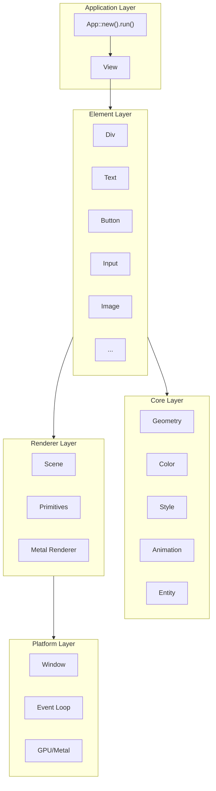
```mermaid
graph TB
    subgraph Application["Application Layer"]
        App["App::new().run()"]
        View["View"]
    end

    subgraph Elements["Element Layer"]
        Div["Div"]
        Text["Text"]
        Button["Button"]
        Input["Input"]
        Image["Image"]
        More["..."]
    end

    subgraph Core["Core Layer"]
        Geometry["Geometry"]
        Color["Color"]
        Style["Style"]
        Animation["Animation"]
        Entity["Entity"]
    end

    subgraph Renderer["Renderer Layer"]
        Scene["Scene"]
        Primitive["Primitives"]
        Metal["Metal Renderer"]
    end

    subgraph Platform["Platform Layer"]
        Window["Window"]
        Event["Event Loop"]
        GPU["GPU/Metal"]
    end

    App --> View
    View --> Elements
    Elements --> Core
    Elements --> Renderer
    Renderer --> Platform
```

## Layer Responsibilities

### 1. Application Layer

The entry point for RUI applications.

```rust
App::new().run(|cx| {
    // Build your UI here
    div()
        .child(text("Hello"))
});
```

**Components:**
- `App` - Application lifecycle management
- `AppContext` - Global application state and services
- `View` - View abstraction for rendering
- `ViewContext` - View-local state and rendering context

### 2. Element Layer

UI building blocks with a declarative builder pattern.

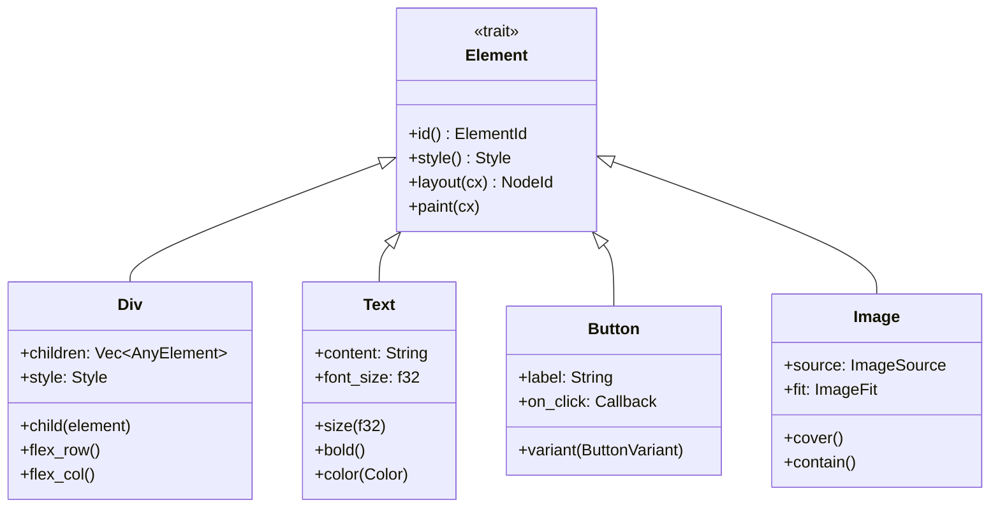
```mermaid
classDiagram
    class Element {
        <<trait>>
        +id() ElementId
        +style() Style
        +layout(cx) NodeId
        +paint(cx)
    }

    class Div {
        +children: Vec~AnyElement~
        +style: Style
        +child(element)
        +flex_row()
        +flex_col()
    }

    class Text {
        +content: String
        +font_size: f32
        +size(f32)
        +bold()
        +color(Color)
    }

    class Button {
        +label: String
        +on_click: Callback
        +variant(ButtonVariant)
    }

    class Image {
        +source: ImageSource
        +fit: ImageFit
        +cover()
        +contain()
    }

    Element <|-- Div
    Element <|-- Text
    Element <|-- Button
    Element <|-- Image
```

### 3. Core Layer

Fundamental types and abstractions.

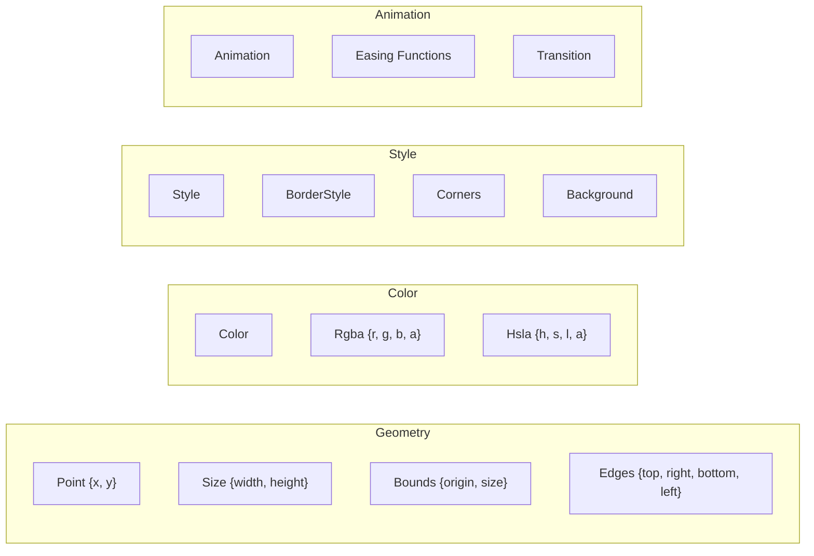
```mermaid
graph LR
    subgraph Geometry
        Point["Point {x, y}"]
        Size["Size {width, height}"]
        Bounds["Bounds {origin, size}"]
        Edges["Edges {top, right, bottom, left}"]
    end

    subgraph ColorSystem["Color"]
        Color["Color"]
        Rgba["Rgba {r, g, b, a}"]
        Hsla["Hsla {h, s, l, a}"]
    end

    subgraph StyleSystem["Style"]
        Style["Style"]
        Border["BorderStyle"]
        Corners["Corners"]
        Background["Background"]
    end

    subgraph AnimationSystem["Animation"]
        Animation["Animation"]
        Easing["Easing Functions"]
        Transition["Transition"]
    end
```

### 4. Renderer Layer

GPU-accelerated rendering pipeline.

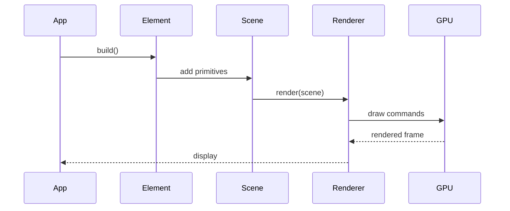
```mermaid
sequenceDiagram
    participant App
    participant Element
    participant Scene
    participant Renderer
    participant GPU

    App->>Element: build()
    Element->>Scene: add primitives
    Scene->>Renderer: render(scene)
    Renderer->>GPU: draw commands
    GPU-->>Renderer: rendered frame
    Renderer-->>App: display
```

**Primitives:**
- `Quad` - Rectangles with background, border, corners
- `Text` - Text rendering with font styling
- `Image` - Texture-based image rendering
- `Shadow` - Drop shadows with blur
- `PushClip/PopClip` - Clip stack for scissoring

### 4.1 Render Scheduling

Rendering is event-driven. The main loop blocks when there are no events and no dirty flags:

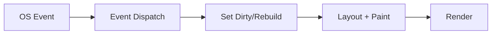
```mermaid
flowchart LR
    A[OS Event] --> B[Event Dispatch]
    B --> C[Set Dirty/Rebuild]
    C --> D[Layout + Paint]
    D --> E[Render]
```

`AppContext` maintains render state and source counters:
- `needs_rebuild`: rebuild the element tree
- `dirty`: re-layout/repaint without rebuilding
- `RedrawSourceCounts`: cumulative counters for explicit, element,
  view-notification, and platform lifecycle/input/resize/focus/redraw requests

Explicit runtime and element redraw requests are coalesced before they post a
platform redraw event. Native platform events still mark the app dirty and bump
their source counters, but they do not create an extra wake event while the loop
is already processing AppKit input.

### 4.1.1 Runtime Ownership and State Contracts

RUI separates long-lived application state from the short-lived element tree:

- `AppContext` owns framework state: the `EntityStore`, windows, pending view updates, and dirty/rebuild flags.
- `App::run_view` and `testing::mount_view` own a long-lived `View` inside `RuntimeView`; each rebuild calls `View::render` with a fresh `ViewContext`.
- Caller-owned state may live outside RUI, such as `Rc<Cell<T>>`, `Rc<RefCell<T>>`, or application data protected by the caller. Event callbacks can mutate that state, then call `ViewNotifier::notify` to request a rebuild.
- Component-local state belongs to the current element instance, for example hover, pressed, focused, selected, and text-editing transients. It may be replaced on rebuild, so persistent values should be supplied by caller state or an `AppContext` entity.

Typed handles are context-bound:

- `Entity<T>` is a typed handle, not the state itself. Clone or copy the handle freely, but read or mutate the value only through `AppContext::get` or `AppContext::get_mut` while an `AppContext` or `ViewContext` is active.
- Borrowed `Ref` and `RefMut` values from the entity store must not escape the current render or callback scope.
- A `ViewContext` grants access to the current view entity and to `AppContext` only for the duration of `render`.
- `ViewNotifier` is the safe object to move into callbacks. It does not expose state; it only schedules the owning view to rebuild on the next runtime pass.

RUI does not currently expose a separate `Model` trait. Model-like state should be represented as caller-owned state or as typed `Entity<T>` values in `AppContext` until a dedicated model API exists.

### 4.2 Resource Pipeline

The renderer owns explicit resource caches for text, images, and GPU textures:
- Text is rasterized via `rusttype` and tracked as glyph resources by `(content, size, weight, family)`
- Images are decoded via `image`, tracked by source key, and fail explicitly on invalid data
- Texture uploads are tracked as renderer-owned resources with observable pressure and disposal counters

Caches lazily upload textures to the GPU on first use. Resource pressure must
evict only inactive entries; active visible content returns a renderer error
instead of being silently dropped.

### 5. Platform Layer

OS-specific window and event handling.

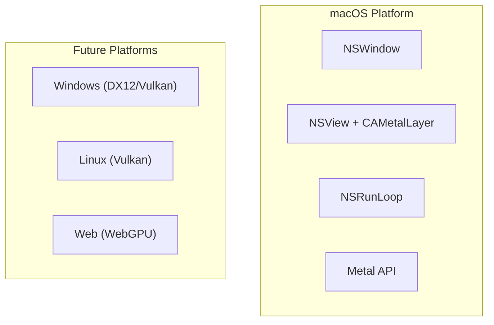
```mermaid
graph TB
    subgraph macOS["macOS Platform"]
        Window["NSWindow"]
        View["NSView + CAMetalLayer"]
        EventLoop["NSRunLoop"]
        Metal["Metal API"]
    end

    subgraph Future["Future Platforms"]
        Windows["Windows (DX12/Vulkan)"]
        Linux["Linux (Vulkan)"]
        Web["Web (WebGPU)"]
    end
```

## Data Flow

### Rendering Pipeline

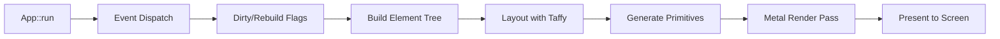
```mermaid
flowchart LR
    A[App::run] --> B[Event Dispatch]
    B --> C[Dirty/Rebuild Flags]
    C --> D[Build Element Tree]
    D --> E[Layout with Taffy]
    E --> F[Generate Primitives]
    F --> G[Metal Render Pass]
    G --> H[Present to Screen]
```

### Event Flow

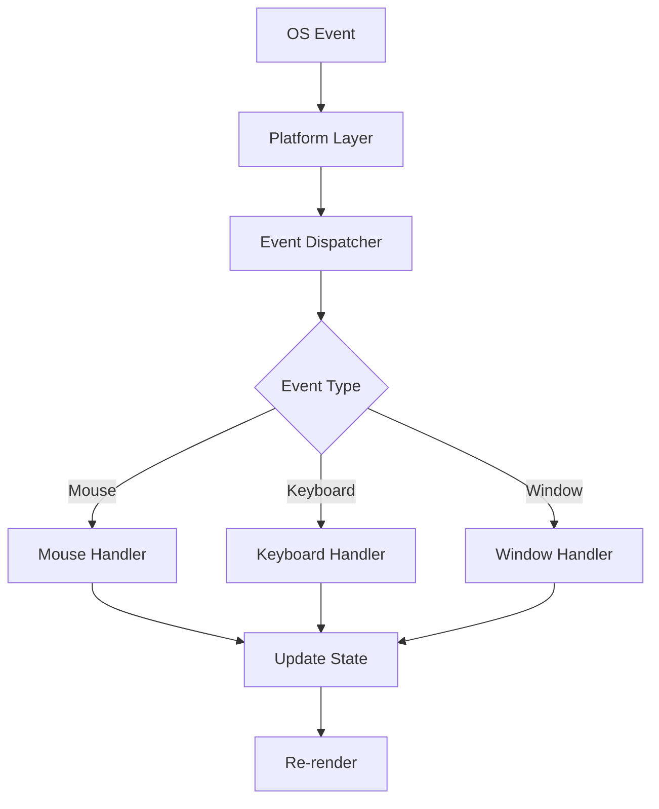
```mermaid
flowchart TB
    A[OS Event] --> B[Platform Layer]
    B --> C[Event Dispatcher]
    C --> D{Event Type}
    D -->|Mouse| E[Mouse Handler]
    D -->|Keyboard| F[Keyboard Handler]
    D -->|Window| G[Window Handler]
    E --> H[Update State]
    F --> H
    G --> H
    H --> I[Re-render]
```

## Layout System

RUI uses [Taffy](https://github.com/DioxusLabs/taffy) for Flexbox layout.

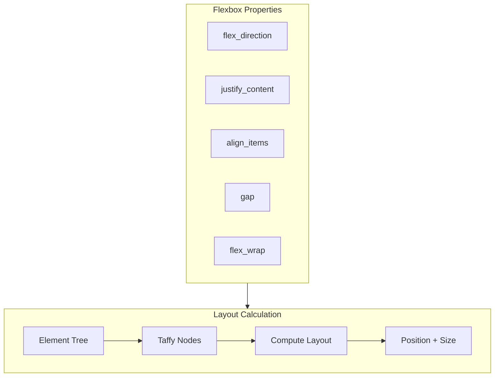
```mermaid
graph TB
    subgraph Layout["Layout Calculation"]
        A[Element Tree] --> B[Taffy Nodes]
        B --> C[Compute Layout]
        C --> D[Position + Size]
    end

    subgraph Flexbox["Flexbox Properties"]
        direction["flex_direction"]
        justify["justify_content"]
        align["align_items"]
        gap["gap"]
        wrap["flex_wrap"]
    end

    Flexbox --> Layout
```

**Layout Properties:**
- `flex_direction` - Row or Column
- `justify_content` - Main axis alignment
- `align_items` - Cross axis alignment
- `gap` - Space between children
- `padding` - Inner spacing
- `margin` - Outer spacing

## Hooks System

React-like hooks for managing state and side effects.

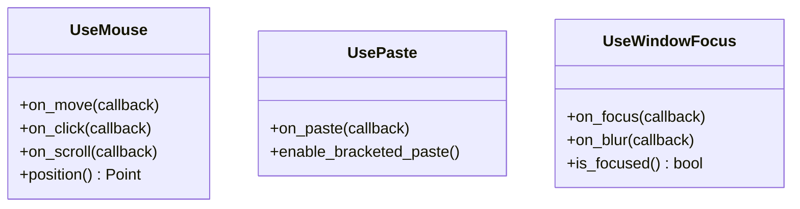
```mermaid
classDiagram
    class UseMouse {
        +on_move(callback)
        +on_click(callback)
        +on_scroll(callback)
        +position() Point
    }

    class UsePaste {
        +on_paste(callback)
        +enable_bracketed_paste()
    }

    class UseWindowFocus {
        +on_focus(callback)
        +on_blur(callback)
        +is_focused() bool
    }
```

## Memory Management

RUI uses Rust's ownership system for memory safety with minimal allocations.

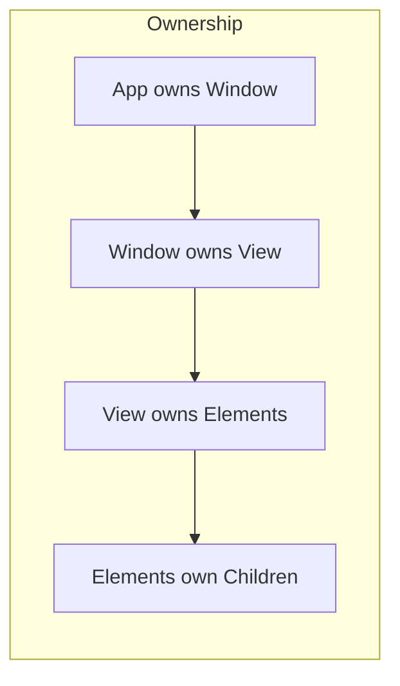
```mermaid
graph LR
    subgraph Ownership
        A[App owns Window]
        B[Window owns View]
        C[View owns Elements]
        D[Elements own Children]
    end

    A --> B --> C --> D
```

**Strategies:**
- `SmallVec` for small collections
- `SlotMap` for entity storage
- Stack allocation for primitives
- GPU buffer pooling

## Module Structure

```
rui/
├── src/
│   ├── lib.rs              # Library entry
│   ├── prelude.rs          # Common exports
│   │
│   ├── core/               # Core types
│   │   ├── app.rs          # Application
│   │   ├── color.rs        # Color types
│   │   ├── geometry.rs     # Geometry types
│   │   ├── style.rs        # Style system
│   │   ├── animation.rs    # Animations
│   │   ├── entity.rs       # Entity system
│   │   ├── view.rs         # View abstraction
│   │   └── window.rs       # Window management
│   │
│   ├── elements/           # UI Elements
│   │   ├── element.rs      # Element trait
│   │   ├── div.rs          # Container
│   │   ├── text.rs         # Text
│   │   ├── button.rs       # Button
│   │   ├── input.rs        # Text input
│   │   ├── image.rs        # Image
│   │   ├── table.rs        # Table
│   │   ├── list.rs         # Lists
│   │   ├── progress.rs     # Progress bar
│   │   └── spinner.rs      # Spinner
│   │
│   ├── hooks/              # React-like hooks
│   │   ├── use_mouse.rs    # Mouse events
│   │   ├── use_paste.rs    # Paste events
│   │   └── use_window_focus.rs
│   │
│   ├── renderer/           # Rendering
│   │   ├── scene.rs        # Scene graph
│   │   └── primitives.rs   # Render primitives
│   │
│   └── platform/           # Platform-specific runtime boundary
│       ├── window.rs       # Shared window backend contract
│       └── mac/            # macOS (Metal)
│
└── examples/               # Example apps
    ├── hello_world.rs
    ├── counter.rs
    ├── dashboard.rs
    └── animation_demo.rs
```

## Performance Considerations

### GPU Rendering
- Direct Metal rendering bypasses CPU-bound drawing
- Primitives are drawn in order for correctness
- Future optimization: batch compatible primitives

### Layout Caching
- Current implementation clears the layout tree on every rendered frame.
- Future optimization: persistent Taffy nodes + incremental dirty propagation.

### Memory Efficiency
- Zero-copy where possible
- Pre-allocated buffers
- Minimal heap allocations in hot paths

## Future Directions

1. **Cross-Platform Support**
   - Implement the shared platform window contract before claiming support
   - Vulkan renderer for Windows/Linux
   - WebGPU for browser support

2. **State Management**
   - `use_state` hook
   - `use_effect` for side effects
   - Context system for shared state

3. **Advanced Features**
   - Text editing/selection
   - Accessibility support
   - Internationalization
